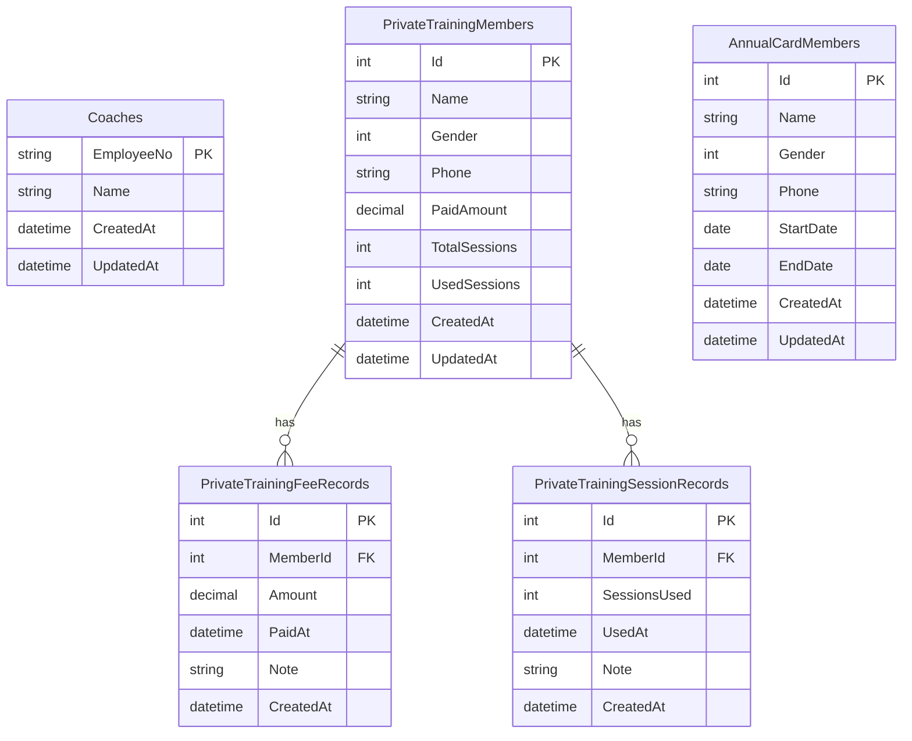

# 数据库关系（ERD）

> 说明：下图为“管理端”第一期所需的数据关系。后续如果要做“教练-私教会员”分配，可在 `PrivateTrainingMembers` 增加 `CoachEmployeeNo` 外键即可扩展。

```mermaid
erDiagram
    Coaches {
        string EmployeeNo PK
        string Name
        datetime CreatedAt
        datetime UpdatedAt
    }

    PrivateTrainingMembers {
        int Id PK
        string Name
        int Gender
        string Phone
        decimal PaidAmount
        int TotalSessions
        int UsedSessions
        datetime CreatedAt
        datetime UpdatedAt
    }

    PrivateTrainingFeeRecords {
        int Id PK
        int MemberId FK
        decimal Amount
        datetime PaidAt
        string Note
        datetime CreatedAt
    }

    PrivateTrainingSessionRecords {
        int Id PK
        int MemberId FK
        int SessionsUsed
        datetime UsedAt
        string Note
        datetime CreatedAt
    }

    AnnualCardMembers {
        int Id PK
        string Name
        int Gender
        string Phone
        date StartDate
        date EndDate
        datetime CreatedAt
        datetime UpdatedAt
    }

    PrivateTrainingMembers ||--o{ PrivateTrainingFeeRecords : "has"
    PrivateTrainingMembers ||--o{ PrivateTrainingSessionRecords : "has"
```

